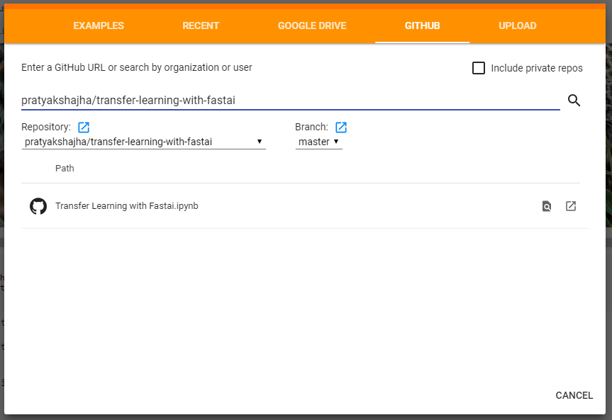

# Fastai Deep Learning Part 1 course

This repo consists of all my codes and notes from fastai deep learning course. 

All the python notebooks have been written for colab specifically. To run any notebook, open them in colab by:

+ Select `upload notebook` under `File`.
+ Enter Username and repo name as below. Click on the noebook you want to get started. 

 

---
Alternatively, install [this](!https://chrome.google.com/webstore/detail/open-in-colab/iogfkhleblhcpcekbiedikdehleodpjo/related) extension for chrome to open any python notebooks hosted on GitHub directly in Colab.